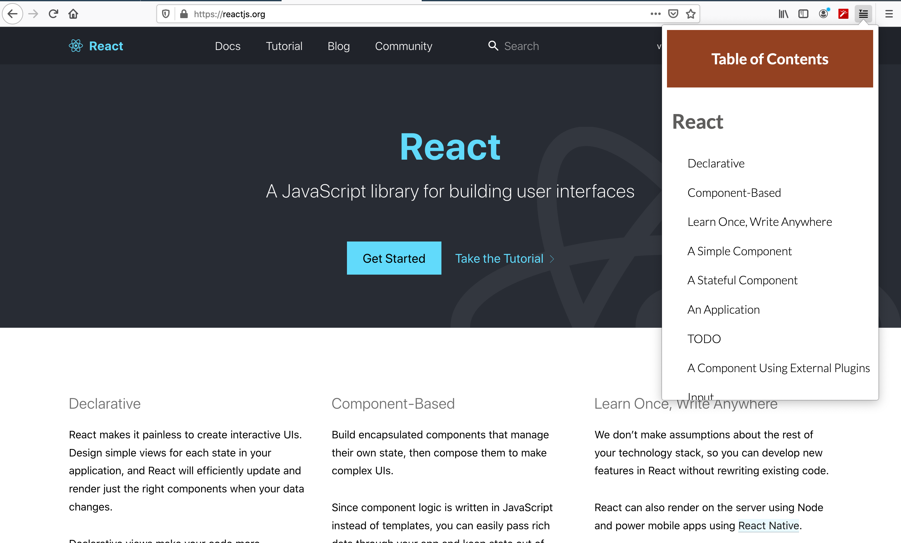

# Table of Contents | Firefox Extension

A Firefox extension that allows you to see a "table of contents" like overview of the current webpage you are on. 

Clicking on one of the section names will bring you to that location on the webpage. 

Useful for blog style web pages and navigating coding docs.

## Installation

1) Clone this repo
2) Open Firefox
3) Navigate to about:bugging 
4) Go to where you saved the project and load the manifest.json
5) Go to any webpage and let the extension work its magic!

## Contributing

1. Fork it (https://github.com/nyu-ossd-s20/table_of_contents/fork)
2. Create your feature branch (`git checkout -b feature/fooBar`)
3. Commit your changes (`git commit -am 'Add some fooBar'`)
4. Push to the branch (`git push origin feature/fooBar`)
5. Create a new Pull Request

<!-- LICENSE -->
## License

Distributed under the MPL-2.0 License. See `LICENSE` for more information.

<!-- CODE OF CONDUCT -->
## Code of Conduct

[We follow these community guidelines](https://www.mozilla.org/en-US/about/governance/policies/participation/)

<!-- CONTACT -->
## Contact

* [Prince Carter](https://github.com/PrinceCarter)
* [Kyla Yujiri](https://github.com/kylayujiri)
* [Matthew Fan](https://github.com/mattfan00)

